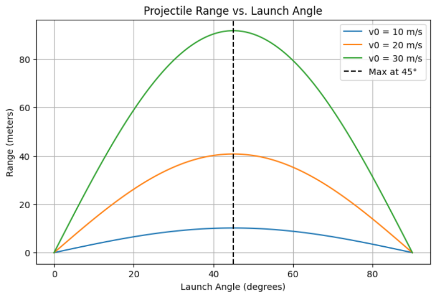
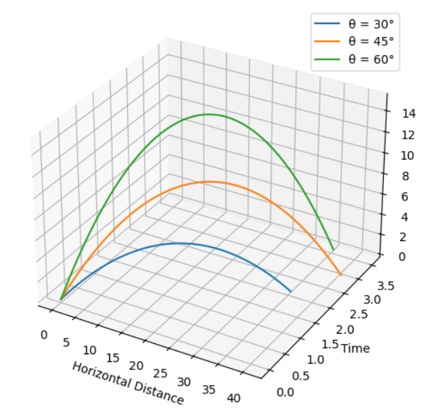
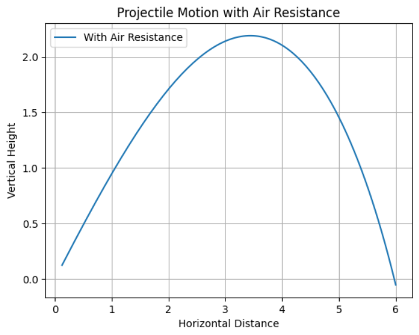

# **Investigating the Range as a Function of the Angle of Projection**  

## **1. Introduction**  

Projectile motion is a classical problem in physics, demonstrating fundamental principles of kinematics and dynamics. The study of projectile motion has extensive applications in fields like **engineering, sports, ballistics, aerospace, and video game physics**.  

This report explores how the **range** of a projectile depends on its angle of projection. By analyzing these dependencies, we uncover important insights into real-world problems, from optimizing a soccer kick to launching spacecrafts.  

### **Key Questions Explored:**  
- How does the range of a projectile change with launch angle?  
- What is the optimal launch angle for maximum range?  
- How do environmental factors (air resistance, wind, gravity variations) impact projectile motion?  

---

## **2. Theoretical Foundations**  

### **2.1 Governing Equations of Motion**  

Projectile motion follows **Newton’s Laws**, particularly the equations of motion under uniform acceleration. Given an initial velocity \( v_0 \) and launch angle \( \theta \), we break the motion into:  

#### **Horizontal Motion**  
$$
 x = v_0 \cos(\theta) t
$$
$$
 v_x = v_0 \cos(\theta)  \quad (\text{constant})
$$

#### **Vertical Motion**  
$$
 y = v_0 \sin(\theta) t - \frac{1}{2} g t^2
$$
$$
 v_y = v_0 \sin(\theta) - g t
$$

where:  
- \( g \) is the acceleration due to gravity (9.81 m/s² on Earth).  

2.2 Time of Flight  
The projectile reaches the ground when \( y = 0 \):  
$$[
t_f = \frac{2 v_0 \sin(\theta)}{g}
$$]

2.3 Range Equation  
The horizontal distance (range) at landing is:  
$$[
R = v_0 \cos(\theta) t_f = \frac{v_0^2 \sin(2\theta)}{g}
$$]
From this equation, we note:
- Max range occurs at \( \theta = 45^\circ \).
- Range is symmetric: \( 30^\circ \) and \( 60^\circ \) give the same range.
  

---

## **3. Advanced Theoretical Considerations**  

### **3.1 Finding the Maximum Range**  
Taking the derivative of \( R(\theta) \) and setting it to zero:  
$$
 \frac{dR}{d\theta} = \frac{2 v_0^2 \cos(2\theta)}{g} = 0
$$
Solving for \( \theta \):  
$$
 2\theta = 90^\circ \Rightarrow \theta = 45^\circ
$$
Thus, **the maximum range is at \( 45^\circ \)**.

### **3.2 Effect of Air Resistance**  
With air resistance \( F_d = \frac{1}{2} C_d \rho A v^2 \), the equations become:  
$$
 m \frac{dv_x}{dt} = -F_d \cos(\theta)
$$
$$
 m \frac{dv_y}{dt} = -mg - F_d \sin(\theta)
$$
These equations require numerical methods for solutions.

---

## **4. Python Implementation**  

### **4.1 Range vs. Angle (Basic Model)**  

```python
import numpy as np
import matplotlib.pyplot as plt

def projectile_range(v0, theta, g=9.81):
    return (v0**2 * np.sin(2 * np.radians(theta))) / g

angles = np.linspace(0, 90, 100)
v0_values = [10, 20, 30]

plt.figure(figsize=(8,5))
for v0 in v0_values:
    ranges = [projectile_range(v0, theta) for theta in angles]
    plt.plot(angles, ranges, label=f'v0 = {v0} m/s')

plt.axvline(45, linestyle='--', color='black', label='Max at 45°')
plt.xlabel('Launch Angle (degrees)')
plt.ylabel('Range (meters)')
plt.title('Projectile Range vs. Launch Angle')
plt.legend()
plt.grid()
plt.show()
```


```python 
from mpl_toolkits.mplot3d import Axes3D

fig = plt.figure(figsize=(10, 6))
ax = fig.add_subplot(111, projection='3d')

for theta in [30, 45, 60]:
    t = np.linspace(0, 2*v0*np.sin(np.radians(theta))/g, 100)
    x = v0 * np.cos(np.radians(theta)) * t
    y = v0 * np.sin(np.radians(theta)) * t - 0.5 * g * t**2
    ax.plot(x, t, y, label=f'θ = {theta}°')

ax.set_xlabel('Horizontal Distance')
ax.set_ylabel('Time')
ax.set_zlabel('Vertical Height')
ax.legend()
plt.show()

```



```python
def projectile_with_drag(v0, theta, g=9.81, Cd=0.47, rho=1.225, A=0.01, m=0.1, dt=0.01):
    vx = v0 * np.cos(np.radians(theta))
    vy = v0 * np.sin(np.radians(theta))
    x, y = 0, 0
    positions = []

    while y >= 0:
        v = np.sqrt(vx**2 + vy**2)
        Fd = 0.5 * Cd * rho * A * v**2
        ax = -Fd * vx / m
        ay = -g - (Fd * vy / m)

        vx += ax * dt
        vy += ay * dt
        x += vx * dt
        y += vy * dt
        positions.append((x, y))

    return np.array(positions)

pos = projectile_with_drag(20, 45)
plt.plot(pos[:, 0], pos[:, 1], label='With Air Resistance')
plt.xlabel('Horizontal Distance')
plt.ylabel('Vertical Height')
plt.title('Projectile Motion with Air Resistance')
plt.legend()
plt.grid()
plt.show()

```



## 5. Real-World Applications

### Sports:
- **Optimizing soccer free kicks, basketball shots, and javelin throws.**

### Engineering:
- **Calculating projectile paths in ballistics and aerospace.**

### Space Science:
- **Determining launch angles for interplanetary missions.**

### Video Games:
- **Simulating realistic projectile motion in physics engines.**

---

## 6. Conclusion & Future Work

Projectile motion is fundamental in physics, but real-world factors like air resistance, wind, and non-uniform gravity make it complex. Future studies can use:

- **Machine Learning** for predictive modeling of projectile behavior.
- **CFD Simulations** to analyze drag forces in different environments.
- **Monte Carlo Methods** for uncertainty analysis in real-world applications.

This study provides a detailed framework for analyzing projectile motion and lays the foundation for more advanced research in physics, engineering, and beyond. 
