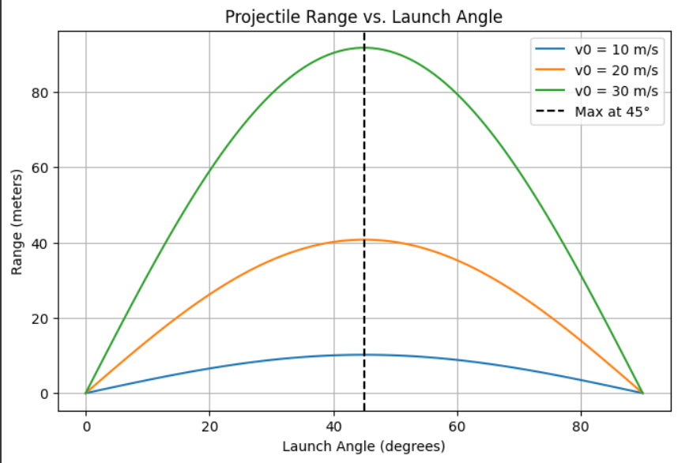

# Problem 2
## Investigating the Dynamics of a Forced Damped Pendulum

## **1. Understanding the Physical System**
A **pendulum** is a fundamental mechanical system that exhibits a variety of motion types, including periodic, damped, and chaotic behaviors, depending on external influences. When **damping (friction)** and **external periodic forcing** are introduced, the motion becomes more complex and can exhibit chaotic behavior.

The governing equation of motion for a **forced damped pendulum** is:

$$
\frac{d^2\theta}{dt^2} + b \frac{d\theta}{dt} + \frac{g}{L} \sin\theta = A \cos(\omega t)
$$

where:
-$\theta$ is the angular displacement (radians).
- $b$ is the damping coefficient, accounting for resistive forces.
- $g$ is the acceleration due to gravity.
- $L$ is the length of the pendulum.
- $A \cos(\omega t)$ represents the external periodic driving force with amplitude $A$ and frequency $\omega$.

### **Key Concepts**
1. **Simple Harmonic Motion**: If $b = 0$ and $A = 0$, the motion is simple harmonic for small angles.
2. **Damped Motion**: If $b > 0$ and $A = 0$, oscillations decay over time due to resistive forces.
3. **Forced Motion**: If $A > 0$, an external force drives the pendulum, leading to resonance and chaotic behavior.

---

## **2. Transforming the Equation for Numerical Methods**
The equation above is a **second-order differential equation**, which must be rewritten as a system of **first-order equations** for numerical solving.

### **Defining State Variables**
We introduce:
- $\theta_1 = \theta$ (position)
- $\theta_2 = \frac{d\theta}{dt}$ (velocity)

Rewriting the system:

$$
\frac{d\theta_1}{dt} = \theta_2
$$

$$
\frac{d\theta_2}{dt} = -b\theta_2 - \frac{g}{L} \sin\theta_1 + A \cos(\omega t)
$$

This form allows us to apply numerical integration techniques like **Runge-Kutta (RK45)**.

---

## **3. Choosing a Numerical Solver**
We employ the **Runge-Kutta (RK45) method**, which is well-suited for solving nonlinear differential equations. This method is preferred because:

- It **handles nonlinearity** effectively.
- It dynamically **adjusts step size** for accuracy.
- It is frequently used for **chaotic systems** like the forced damped pendulum.

---

## **4. Setting Up Initial Conditions**
The initial state of the pendulum significantly affects its behavior. We define:

$$
\theta(0) = \theta_0, \quad \frac{d\theta}{dt}(0) = \omega_0
$$

For example:
- **Small initial displacement**: $\theta_0 = 0.1$ rad.
- **Initially at rest**: $\omega_0 = 0$ rad/s.

---

## **5. Running the Simulation**
To numerically integrate the system:
1. Define the time span for simulation (e.g., $t \in [0, 50]$).
2. Solve the equations using the **RK45 method**.
3. Store and analyze the results over time.

---
## **Implementation in Python**
```python
import numpy as np
import matplotlib.pyplot as plt
from scipy.integrate import solve_ivp

# Parameters
g = 9.81   # Gravity (m/s^2)
L = 1.0    # Length of the pendulum (m)
b = 0.2    # Damping coefficient
omega = 2.0  # Driving frequency

# Define the system of ODEs
def forced_damped_pendulum(t, y, A, omega):
    theta, omega_dot = y
    dtheta_dt = omega_dot
    domega_dt = -b * omega_dot - (g / L) * np.sin(theta) + A * np.cos(omega * t)
    return [dtheta_dt, domega_dt]

# Initial conditions
t0, t_end = 0, 50
initial_conditions = [0.1, 0]  # Small initial angle and zero initial velocity

# Solve the system
time_eval = np.linspace(t0, t_end, 2000)
A = 1.2  # Set A for initial run
sol = solve_ivp(forced_damped_pendulum, [t0, t_end], initial_conditions, args=(A, omega), t_eval=time_eval, method='RK45')

# Extract results
theta = sol.y[0]
omega_values = sol.y[1]
time = sol.t

# Time Series Plot
plt.figure(figsize=(10, 5))
plt.plot(time, theta, label=r'$\theta(t)$', color='b')
plt.xlabel('Time (s)')
plt.ylabel('Angular Position (rad)')
plt.title('Forced Damped Pendulum Motion')
plt.legend()
plt.grid()
plt.show()

# Phase Portrait
plt.figure(figsize=(6, 6))
plt.plot(theta, omega_values, lw=0.8, color='r')
plt.xlabel(r'$\theta$ (rad)')
plt.ylabel(r'$\dot{\theta}$ (rad/s)')
plt.title('Phase Portrait')
plt.grid()
plt.show()

# Poincaré Section (Stroboscopic Map)
omega_scalar = float(np.mean(omega_values)) if isinstance(omega_values, np.ndarray) else omega
if omega_scalar != 0:
    poincare_times = np.arange(t0, t_end, 2 * np.pi / omega_scalar)
else:
    poincare_times = np.linspace(t0, t_end, 50)  # Fallback to evenly spaced points

theta_poincare = np.interp(poincare_times, time, theta)
omega_poincare = np.interp(poincare_times, time, omega_values)

plt.figure(figsize=(6, 6))
plt.scatter(theta_poincare, omega_poincare, s=10, color='green')
plt.xlabel(r'$\theta$ (rad)')
plt.ylabel(r'$\dot{\theta}$ (rad/s)')
plt.title('Poincaré Section')
plt.grid()
plt.show()

# Bifurcation Diagram - Sweeping Driving Force Amplitude
A_values = np.linspace(0, 2, 50)
final_theta = []

for A_val in A_values:
    sol = solve_ivp(forced_damped_pendulum, [t0, t_end], initial_conditions, args=(A_val, omega), 
                    t_eval=np.linspace(t_end-10, t_end, 500), method='RK45')
    final_theta.append(sol.y[0][-1])

plt.figure(figsize=(10, 6))
plt.scatter(A_values, final_theta, s=1, color='blue')
plt.xlabel('Driving Force Amplitude (A)')
plt.ylabel('Final Angular Position (rad)')
plt.title('Bifurcation Diagram')
plt.grid()
plt.show()
```




## **6. Visualizing Results**
After solving for $\theta(t)$, we analyze its behavior using different graphical representations:

### **(a) Time Series Plot**
- Shows how $\theta(t)$ evolves over time.
- Helps detect periodicity, resonance, or chaotic motion.

### **(b) Phase Portrait**
- Plots **angular position ( $\theta$ ) vs. angular velocity ($\dot{\theta}$)**.
- **Closed loops** indicate periodic motion, while **scattered points** suggest chaos.

### **(c) Poincaré Section**
- Captures **stroboscopic points** sampled at regular intervals.
- Helps distinguish between **regular and chaotic motion**.

### **(d) Bifurcation Diagram**
- Varies the **driving force amplitude (A)** to observe transitions in motion.
- Reveals transitions from **stability to chaos**.

---

## **7. Analyzing the Behavior**
Different values of parameters lead to different types of motion:

### **(a) Small Forcing and Weak Damping**
- The pendulum exhibits **simple periodic oscillations**.
- The phase portrait shows **smooth elliptical loops**.

### **(b) Resonance Condition**
- When $\omega$ matches the **natural frequency** $\omega_0 = \sqrt{g/L}$, large oscillations occur.
- Energy accumulates over time, leading to strong oscillations.

### **(c) Strong Damping**
- Oscillations decay quickly, leading to **overdamped motion**.

### **(d) Chaotic Motion**
- For specific values of $A$ and $\omega$, the system exhibits **sensitive dependence on initial conditions**.
- Small changes in $\theta_0$ lead to **divergent** trajectories (butterfly effect).

---

## **8. Conclusion**
- The **forced damped pendulum** is a rich nonlinear system that displays a variety of behaviors, from periodic to chaotic motion.
- Using **numerical simulations**, we can analyze its response to different parameters.
- Tools like **Poincaré sections and bifurcation diagrams** help classify its dynamical regimes.