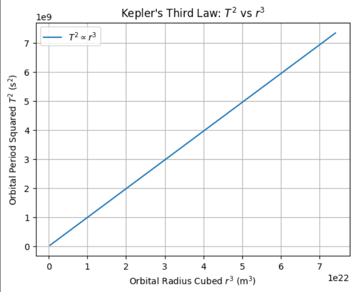

# Problem 1
# # Orbital Period and Orbital Radius

## Motivation
Kepler's Third Law provides a fundamental insight into orbital mechanics:

> The square of the orbital period ($T^2$) of a planet is directly proportional to the cube of the semi-major axis ($r^3$) of its orbit:

$$ T^2 \propto r^3 $$

This law is essential for understanding the motion of celestial bodies under the influence of gravity.

## Derivation for Circular Orbits

Consider a body of mass $m$ orbiting a larger mass $M$ (e.g., a planet orbiting the Sun) in a circular orbit.

1. Gravitational force provides the necessary centripetal force:

$$ \frac{G M m}{r^2} = \frac{m v^2}{r} $$

2. Simplify and solve for velocity $v$:

$$ v^2 = \frac{G M}{r} $$

3. Orbital period is:

$$ T = \frac{2\pi r}{v} $$

Substitute $v$:

$$ T = 2\pi r \sqrt{\frac{r}{G M}} = 2\pi \sqrt{\frac{r^3}{G M}} $$

4. Therefore,

$$ T^2 = \frac{4\pi^2 r^3}{G M} $$

This confirms Kepler's Third Law:

$$ T^2 \propto r^3 $$

## Implications in Astronomy

- Allows determination of planetary masses.
- Enables calculation of distances in planetary systems.
- Satellite orbit planning relies heavily on this law.
- Used in exoplanet studies to estimate star and planet properties.

## Real-World Examples

### Example: Moon Around Earth
- Orbital radius $r \approx 3.84 \times 10^8$ m
- Orbital period $T \approx 27.3$ days $= 2.36 \times 10^6$ s

Compute $\frac{T^2}{r^3}$:

$$ \frac{(2.36 \times 10^6)^2}{(3.84 \times 10^8)^3} \approx 2.95 \times 10^{-14} $$

### Example: Earth Around Sun
- $r \approx 1.5 \times 10^{11}$ m
- $T = 1$ year $= 3.15 \times 10^7$ s

$$ \frac{T^2}{r^3} \approx 2.96 \times 10^{-19} $$

## Python Simulation of Circular Orbits

```python
import numpy as np
import matplotlib.pyplot as plt

# Constants
G = 6.67430e-11  # gravitational constant (m^3 kg^-1 s^-2)
M = 5.972e24     # mass of Earth (kg)
radii = np.linspace(7e6, 4.2e7, 100)  # from 7000 km to 42000 km

# Calculate orbital period T for each radius
T = 2 * np.pi * np.sqrt(radii**3 / (G * M))

# Plot T^2 vs r^3
plt.figure()
plt.plot(radii**3, T**2, label=r'$T^2 \propto r^3$')
plt.xlabel(r'Orbital Radius Cubed $r^3$ (m$^3$)')
plt.ylabel(r'Orbital Period Squared $T^2$ (s$^2$)')
plt.title("Kepler's Third Law: $T^2$ vs $r^3$")
plt.grid(True)
plt.legend()
plt.show()
```

## Extension to Elliptical Orbits
Kepler's Third Law also holds for elliptical orbits when $r$ is replaced with the semi-major axis $a$:

$$ T^2 = \frac{4\pi^2 a^3}{G M} $$

This general form explains motions of planets, comets, and exoplanets with non-circular orbits.