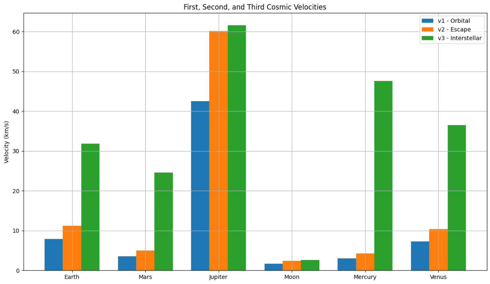

# Problem 2
# # Escape Velocities and Cosmic Velocities

## Motivation
Escape velocity and the concept of cosmic velocities are essential to the understanding of gravitational dynamics in astrodynamics and interplanetary travel. They define the energy thresholds needed to transition between different gravitational regimes. This knowledge is crucial in designing space missions—from launching satellites to exploring other planets and venturing beyond the solar system.

---

## Definitions

### First Cosmic Velocity ($v_1$)
Also known as orbital velocity, this is the minimum velocity an object must maintain to stay in a stable circular orbit just above the surface of a celestial body:

$$ v_1 = \sqrt{\frac{G M}{R}} $$

Where:
- $G$ is the gravitational constant
- $M$ is the mass of the celestial body
- $R$ is the radius of the celestial body

### Second Cosmic Velocity ($v_2$)
Escape velocity is the minimum speed needed to break free from a celestial body's gravitational pull without further propulsion:

$$ v_2 = \sqrt{\frac{2 G M}{R}} = \sqrt{2} v_1 $$

This speed allows an object to move to infinity with zero residual velocity, assuming no resistance.

### Third Cosmic Velocity ($v_3$)
This is the minimum velocity required for a spacecraft to escape not only Earth’s gravity but also the Sun’s, effectively allowing it to exit the solar system:

$$ v_3 = \sqrt{v_2^2 + v_{\text{orbital}}^2} $$

Where $v_{\text{orbital}}$ is the orbital speed of the planet around the Sun.

---

## Factors Affecting Cosmic Velocities
- **Mass ($M$)**: Higher planetary mass increases the gravitational attraction, raising all three velocities.
- **Radius ($R$)**: Smaller radius increases surface gravity, raising the required velocities.
- **Distance from other bodies**: For $v_3$, the position in the solar system matters due to gravitational influence from the Sun and other planets.

---

## Python Code: Cosmic Velocities Simulation

```python
import numpy as np
import matplotlib.pyplot as plt

# Constants
G = 6.67430e-11  # gravitational constant in m^3/kg/s^2

# Planetary data: name, mass (kg), radius (m), orbital speed around Sun (m/s)
bodies = {
    'Earth': {'mass': 5.972e24, 'radius': 6.371e6, 'v_orbit': 29780},
    'Mars': {'mass': 6.417e23, 'radius': 3.390e6, 'v_orbit': 24070},
    'Jupiter': {'mass': 1.898e27, 'radius': 6.9911e7, 'v_orbit': 13070},
    'Moon': {'mass': 7.347e22, 'radius': 1.737e6, 'v_orbit': 1022},
    'Mercury': {'mass': 3.301e23, 'radius': 2.439e6, 'v_orbit': 47400},
    'Venus': {'mass': 4.867e24, 'radius': 6.052e6, 'v_orbit': 35000},
}

# Calculate velocities
results = {}
for body, data in bodies.items():
    M, R, v_orbit = data['mass'], data['radius'], data['v_orbit']
    v1 = np.sqrt(G * M / R)
    v2 = np.sqrt(2 * G * M / R)
    v3 = np.sqrt(v2**2 + v_orbit**2)
    results[body] = {'v1': v1, 'v2': v2, 'v3': v3}

# Print results
print("Cosmic Velocities (in km/s):\n")
for body, velocities in results.items():
    print(f"{body}:")
    print(f"  First Cosmic Velocity (v1): {velocities['v1'] / 1000:.2f} km/s")
    print(f"  Second Cosmic Velocity (v2): {velocities['v2'] / 1000:.2f} km/s")
    print(f"  Third Cosmic Velocity (v3): {velocities['v3'] / 1000:.2f} km/s\n")

# Visualization
labels = list(bodies.keys())
v1_vals = [results[body]['v1'] / 1000 for body in labels]
v2_vals = [results[body]['v2'] / 1000 for body in labels]
v3_vals = [results[body]['v3'] / 1000 for body in labels]

x = np.arange(len(labels))
width = 0.25

plt.figure(figsize=(12,7))
plt.bar(x - width, v1_vals, width, label='v1 - Orbital')
plt.bar(x, v2_vals, width, label='v2 - Escape')
plt.bar(x + width, v3_vals, width, label='v3 - Interstellar')

plt.xticks(x, labels)
plt.ylabel('Velocity (km/s)')
plt.title('First, Second, and Third Cosmic Velocities')
plt.legend()
plt.grid(True)
plt.tight_layout()
plt.show()
```

---

## Analysis and Real-World Context

### Earth
- $v_1 \approx 7.91$ km/s: used for satellites in low Earth orbit.
- $v_2 \approx 11.19$ km/s: needed for lunar and interplanetary missions.
- $v_3 \approx 42.1$ km/s: required for spacecraft to leave the Solar System.

### Mars
- Lower gravity results in lower escape and orbital velocities.
- Useful for future Mars colonization and exploration missions.

### Jupiter
- Enormous gravity increases required velocities significantly.
- Missions to Jupiter require major energy inputs or gravity assists.

### Other Bodies
- The Moon's low gravity makes it an ideal candidate for a space station.
- Venus and Mercury, while closer to the Sun, still require precision due to solar gravity.

---

## Importance in Space Exploration
- **First Cosmic Velocity**: Key for satellite deployment and orbital stations.
- **Second Cosmic Velocity**: Used in deep-space missions (e.g., Mars, asteroids).
- **Third Cosmic Velocity**: Enables interstellar exploration (e.g., Voyager 1 & 2).

Understanding and optimizing for these velocities ensures cost-effective and technically feasible space missions. Every planetary mission, satellite launch, or interstellar probe relies on these fundamental velocity thresholds.

---