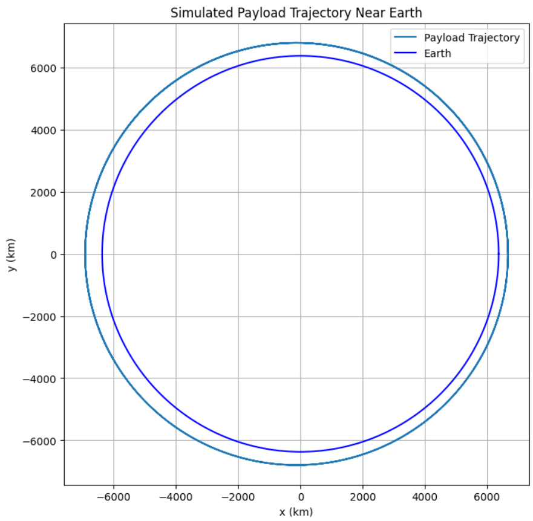

# Problem 3
# # Trajectories of a Freely Released Payload Near Earth

## Motivation

When a payload is released from a spacecraft in orbit around Earth, its subsequent trajectory is governed by gravitational forces and its initial velocity and position. The object may re-enter Earth, remain in orbit, or escape into interplanetary space depending on its energy and direction. Analyzing these scenarios provides insights into orbital dynamics and mission planning.

---

## Fundamental Concepts

### Newton’s Law of Universal Gravitation

The force of gravity between Earth and the payload is:

$$ F = \frac{G M m}{r^2} $$

Where:
- $G = 6.67430 \times 10^{-11}$ m³/kg/s² (gravitational constant)
- $M$ is the mass of Earth ($5.972 \times 10^{24}$ kg)
- $m$ is the mass of the payload
- $r$ is the distance from Earth's center to the payload

### Gravitational Acceleration

Acceleration due to gravity experienced by the payload is:

$$ \vec{a} = -\frac{G M}{r^3} \vec{r} $$

This is a central force that always points toward the center of Earth.

---

## Energy-Based Classification of Trajectories

The total mechanical energy $E$ of the payload is the sum of kinetic and potential energy:

$$ E = \frac{1}{2}mv^2 - \frac{G M m}{r} $$

Depending on $E$, we classify the trajectory as:
- **Elliptical Orbit** ($E < 0$): Bound orbit
- **Parabolic Trajectory** ($E = 0$): Escape trajectory with minimum speed
- **Hyperbolic Trajectory** ($E > 0$): Unbound escape trajectory

The **escape velocity** at a distance $r$ is:

$$ v_{\text{esc}} = \sqrt{\frac{2 G M}{r}} $$

---

## Python Simulation: Numerical Integration of Trajectories

```python
import numpy as np
import matplotlib.pyplot as plt

# Constants
G = 6.67430e-11  # m^3 kg^-1 s^-2
M = 5.972e24     # kg (Earth)
R = 6.371e6      # m (Earth radius)

# Simulation parameters
dt = 1.0             # seconds
t_max = 20000       # total time
steps = int(t_max / dt)

# Initial position and velocity
altitude = 300e3                 # 300 km altitude
r0 = np.array([R + altitude, 0])
v0 = np.array([0, 7800])         # m/s tangential velocity

# Initialize arrays
pos = np.zeros((steps, 2))
vel = np.zeros((steps, 2))
pos[0] = r0
vel[0] = v0

# Gravitational acceleration
def acceleration(r):
    norm_r = np.linalg.norm(r)
    return -G * M * r / norm_r**3

# Euler integration
for i in range(steps - 1):
    acc = acceleration(pos[i])
    vel[i + 1] = vel[i] + acc * dt
    pos[i + 1] = pos[i] + vel[i + 1] * dt

    # Terminate if impact occurs
    if np.linalg.norm(pos[i + 1]) <= R:
        pos = pos[:i + 2]
        break

# Plotting
plt.figure(figsize=(8,8))
plt.plot(pos[:,0] / 1e3, pos[:,1] / 1e3, label='Payload Trajectory')

# Draw Earth
theta = np.linspace(0, 2*np.pi, 300)
earth_x = R * np.cos(theta) / 1e3
earth_y = R * np.sin(theta) / 1e3
plt.plot(earth_x, earth_y, 'b', label='Earth')

plt.xlabel('x (km)')
plt.ylabel('y (km)')
plt.title('Simulated Payload Trajectory Near Earth')
plt.axis('equal')
plt.grid(True)
plt.legend()
plt.show()
```

---

## Case Studies

### 1. Suborbital Re-entry
If the payload velocity is too low, it follows a curved trajectory and returns to Earth. This is common in early ballistic missile flights and re-entry capsules.

### 2. Circular Orbit
If velocity equals:

$$ v = \sqrt{\frac{G M}{r}} $$

The payload enters a circular orbit. This is how most satellites are initially inserted into low Earth orbit.

### 3. Elliptical Orbit
A slightly higher or lower speed than the circular orbit velocity creates an elliptical orbit, with apogee and perigee.

### 4. Escape Trajectory
If the payload exceeds escape velocity, it follows a parabolic or hyperbolic path, depending on the excess energy.

---

## Applications in Space Missions

- **Satellite Deployment**: Calculating correct release velocity ensures successful orbit.
- **Re-entry Modules**: Predicting descent paths improves safety and precision.
- **Space Probes**: Must achieve escape velocity for interplanetary missions.
- **Orbital Maneuvers**: Understanding how changes in velocity affect trajectory enables transfers (e.g., Hohmann transfer).

---

## Summary

This detailed analysis and simulation illustrate how initial velocity and position determine a payload’s trajectory. From orbital insertion to planetary escape, understanding the physics of motion near Earth is essential in aerospace design and mission execution. By adjusting these variables, we can achieve specific orbital goals or safely return payloads to Earth.

Numerical simulation using Python allows us to model these scenarios precisely, opening pathways for deeper exploration of spaceflight dynamics.