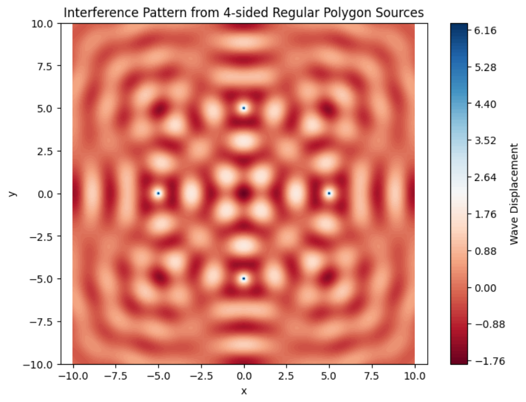

# Interference Patterns on a Water Surface

##  Motivation

Interference occurs when waves from different sources overlap, creating new patterns. On a water surface, this is visually observable when ripples meet, showing how waves reinforce or cancel each other. This task explores interference using a regular polygon arrangement of wave sources.

##  Wave Equation

A single wave from a point source at $((x_0, y_0)$) is described by:

$$
\eta(x, y, t) = \frac{A}{\sqrt{r}} \cos(kr - \omega t + \phi)
$$

Where:
- $( \eta(x, y, t) $): displacement of the water at position $((x, y)$) and time $(t$)
-$( A $): amplitude of the wave
- $( r = \sqrt{(x - x_0)^2 + (y - y_0)^2} $): distance to the point source
- $( k = \frac{2\pi}{\lambda} $): wave number
- $( \omega = 2\pi f $): angular frequency
- $( \phi $): initial phase

##  Problem Setup

1. **Regular Polygon**: Choose a regular polygon (e.g., triangle, square, pentagon).
2. **Wave Sources**: Place point sources at vertices.
3. **Wave Equations**: Define wave from each source.
4. **Superposition**: Total displacement is:

$$
\eta_{sum}(x, y, t) = \sum_{i=1}^{N} \eta_i(x, y, t)
$$

5. **Analyze Patterns**: Identify areas of constructive and destructive interference.
6. **Visualization**: Plot resulting surface pattern.

##  Python Simulation

```python
import numpy as np
import matplotlib.pyplot as plt

# Parameters
A = 1.0               # Amplitude
wavelength = 2.0     # Wavelength (lambda)
f = 1.0              # Frequency
omega = 2 * np.pi * f
k = 2 * np.pi / wavelength
phi = 0              # Initial phase
t = 0.0              # Time snapshot for visualization

# Polygon settings
N = 4                # Number of sources (e.g., 3 for triangle, 4 for square)
R = 5.0              # Radius of the polygon (distance from center to each source)

# Grid for simulation
x = np.linspace(-10, 10, 500)
y = np.linspace(-10, 10, 500)
X, Y = np.meshgrid(x, y)

# Define source positions (vertices of regular polygon)
sources = []
for i in range(N):
    angle = 2 * np.pi * i / N
    x0 = R * np.cos(angle)
    y0 = R * np.sin(angle)
    sources.append((x0, y0))

# Compute total wave displacement at each point
eta_sum = np.zeros_like(X)
for (x0, y0) in sources:
    r = np.sqrt((X - x0)**2 + (Y - y0)**2)
    eta = A / np.sqrt(r + 1e-6) * np.cos(k * r - omega * t + phi)  # Avoid divide-by-zero
    eta_sum += eta

# Plotting
plt.figure(figsize=(8, 6))
plt.contourf(X, Y, eta_sum, levels=100, cmap='RdBu')
plt.colorbar(label='Wave Displacement')
plt.title(f"Interference Pattern from {N}-sided Regular Polygon Sources")
plt.xlabel('x')
plt.ylabel('y')
plt.axis('equal')
plt.grid(False)
plt.show()
```

##  Observations

For a square configuration (\( N = 4 \)):

- **Constructive Interference**: Radial lines where waves reinforce due to phase alignment.
- **Destructive Interference**: Nodes with near-zero amplitude from cancellation.
- The symmetry of the polygon is reflected in the interference pattern.

---