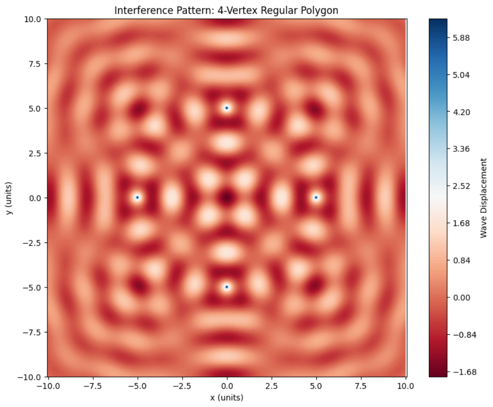

# 🌊 Interference Patterns on a Water Surface

## 🎯 Motivation

Wave interference is a fundamental phenomenon where two or more waves overlap in space, leading to a new wave pattern. On a water surface, this is elegantly demonstrated when ripples from different points meet. Their superposition produces a pattern of reinforcement (constructive interference) and cancellation (destructive interference). These patterns not only provide visual insight into the physics of waves but also model various real-world phenomena including sound, light, and radio wave interactions.

This project aims to visualize interference using wave sources placed at the vertices of a regular polygon. The symmetry and spacing of these sources produce rich interference patterns.

---

## 🧮 Theoretical Background

### Single Point Source Wave

The displacement $( \eta(x, y, t) $) on the surface of the water from a point source at position $((x_0, y_0)$) is modeled by:

$$
\eta(x, y, t) = \frac{A}{\sqrt{r}} \cos(kr - \omega t + \phi)
$$

Where:
- $( A $): Amplitude of the wave
- $( r = \sqrt{(x - x_0)^2 + (y - y_0)^2} $): Distance from source to point $((x, y)$)
- $( k = \frac{2\pi}{\lambda} $): Wave number
- $( \lambda $): Wavelength
- $( \omega = 2\pi f $): Angular frequency
- $( f $): Frequency
- $( \phi $): Initial phase
- $( t $): Time

### Superposition Principle

With multiple coherent sources emitting waves of equal frequency and amplitude, the net displacement is the sum of all individual displacements:

$$
\eta_{sum}(x, y, t) = \sum_{i=1}^{N} \eta_i(x, y, t)
$$

Where $( N $) is the number of wave sources.

---

## 🔧 Simulation Setup

### 1. Define Parameters
- Number of sources $( N $): Vertices of the polygon
- Radius $( R $): Distance from polygon center to each source
- Grid size: Area of simulation in the $( xy $)-plane

### 2. Create Wave Sources
- Sources are placed symmetrically around the origin using trigonometric functions.

### 3. Calculate Wave Contributions
- Use the distance formula for $( r $)
- Sum all contributions to get $( \eta_{sum} $)

### 4. Visualization
- Use contour plots to show high and low displacement regions

---

## 🧪 Python Code

```python
import numpy as np
import matplotlib.pyplot as plt

# === Wave Parameters ===
A = 1.0               # Amplitude
wavelength = 2.0     # Wavelength (lambda)
f = 1.0              # Frequency (Hz)
omega = 2 * np.pi * f
k = 2 * np.pi / wavelength
phi = 0              # Initial phase
t = 0.0              # Snapshot at t seconds

# === Polygon Configuration ===
N = 4                # Number of sources (3=triangle, 4=square, etc.)
R = 5.0              # Radius from center to vertex

# === Grid Setup ===
x = np.linspace(-10, 10, 500)
y = np.linspace(-10, 10, 500)
X, Y = np.meshgrid(x, y)

# === Source Coordinates ===
sources = []
for i in range(N):
    angle = 2 * np.pi * i / N
    x0 = R * np.cos(angle)
    y0 = R * np.sin(angle)
    sources.append((x0, y0))

# === Wave Superposition ===
eta_sum = np.zeros_like(X)
for (x0, y0) in sources:
    r = np.sqrt((X - x0)**2 + (Y - y0)**2)
    eta = A / np.sqrt(r + 1e-6) * np.cos(k * r - omega * t + phi)
    eta_sum += eta

# === Plotting ===
plt.figure(figsize=(10, 8))
contour = plt.contourf(X, Y, eta_sum, levels=150, cmap='RdBu')
plt.colorbar(contour, label='Wave Displacement')
plt.title(f"Interference Pattern: {N}-Vertex Regular Polygon")
plt.xlabel('x (units)')
plt.ylabel('y (units)')
plt.axis('equal')
plt.grid(False)
plt.show()
```

---

## 📊 Observations and Analysis

### 🔹 Constructive Interference
- Occurs at points where waves from all sources arrive **in phase**.
- Results in **amplified displacement**.

### 🔸 Destructive Interference
- Occurs at points where waves arrive **out of phase**.
- Results in **cancellation** or reduced displacement.

### 🌀 Symmetry and Patterns
- The **rotational symmetry** of the polygon is reflected in the interference pattern.
- As $( N $) increases, the pattern becomes more circular and complex.

---

## 🔁 Possible Extensions

- **Animation over time** to show wave propagation
- **Different phase shifts** between sources
- **Changing polygon types**: triangle (N=3), pentagon (N=5), hexagon (N=6)
- **Interactive UI** using sliders for real-time parameter adjustment (with Jupyter widgets or Streamlit)

---

## ✅ Conclusion

This simulation visually demonstrates how regular spatial arrangements of coherent wave sources lead to predictable and beautiful interference patterns. The combination of theory and Python simulation provides a hands-on approach to mastering wave behavior and superposition.

---