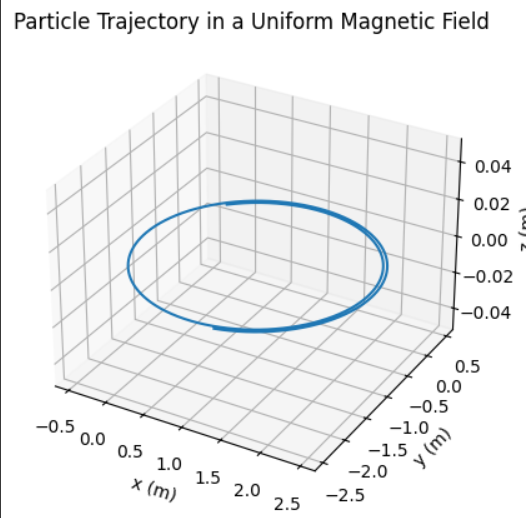

# Lorentz Force Simulation

## 1. Motivation

The Lorentz force governs the motion of charged particles under electric and magnetic fields:

$$
\mathbf{F} = q\mathbf{E} + q\mathbf{v} \times \mathbf{B}
$$

It plays a crucial role in:
- Particle accelerators
- Plasma confinement systems (e.g., Tokamaks)
- Mass spectrometers
- Cosmic ray dynamics

## 2. Applications of the Lorentz Force

- **Particle Accelerators**: Use magnetic fields to bend charged particles into circular paths.
- **Mass Spectrometry**: Employs both electric and magnetic fields to separate ions by mass-to-charge ratio.
- **Plasma Confinement**: Magnetic fields trap hot plasma to maintain fusion conditions.
- **Auroras and Cosmic Rays**: Natural examples of charged particles interacting with Earth's magnetic field.

## 3. Simulation Overview

We simulate the motion of a charged particle using numerical integration. We explore:
- Uniform magnetic field
- Combined electric and magnetic fields
- Crossed fields (orthogonal $\mathbf{E}$ and $\mathbf{B}$)

## 4. Python Code

```python
import numpy as np
import matplotlib.pyplot as plt

# Constants
q = 1.0  # charge (C)
m = 1.0  # mass (kg)
B = np.array([0, 0, 1.0])  # uniform magnetic field (T)
E = np.array([0.0, 0.0, 0.0])  # electric field (V/m)

# Initial state
r0 = np.array([0.0, 0.0, 0.0])  # position (m)
v0 = np.array([1.0, 1.0, 0.0])  # velocity (m/s)

# Time parameters
dt = 0.01
T = 10
steps = int(T / dt)

# Arrays to store data
positions = np.zeros((steps, 3))
velocities = np.zeros((steps, 3))
positions[0] = r0
velocities[0] = v0

# Euler integration
for i in range(steps - 1):
    v = velocities[i]
    F = q * (E + np.cross(v, B))
    a = F / m
    velocities[i+1] = v + a * dt
    positions[i+1] = positions[i] + velocities[i+1] * dt

# Plot trajectory
fig = plt.figure()
ax = fig.add_subplot(111, projection='3d')
ax.plot(positions[:, 0], positions[:, 1], positions[:, 2])
ax.set_title("Particle Trajectory in a Uniform Magnetic Field")
ax.set_xlabel("x (m)")
ax.set_ylabel("y (m)")
ax.set_zlabel("z (m)")
plt.show()
```

## 5. Observations

- In a **uniform magnetic field**, the particle follows a **circular** or **helical** path depending on the initial velocity.
- The radius of the circular motion (Larmor radius) is:

$$
r_L = \frac{mv_{\perp}}{qB}
$$

- With an electric field present, **drift motion** occurs:

$$
\mathbf{v}_d = \frac{\mathbf{E} \times \mathbf{B}}{B^2}
$$

## 6. Extensions

- Introduce **non-uniform fields**: $\mathbf{B}(x, y, z)$ and/or $\mathbf{E}(x, y, z)$.
- Use **Runge-Kutta methods** for improved accuracy.
- Add **relativistic corrections** for high-speed particles.
- Simulate **multiple particles** for beam dynamics or collective effects.
