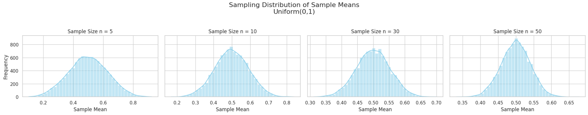
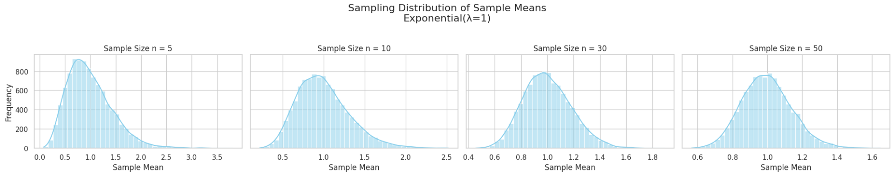
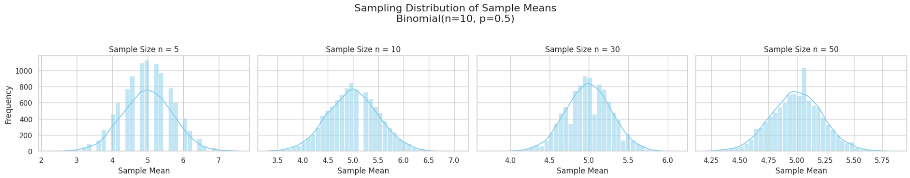

#  Central Limit Theorem (CLT): A Comprehensive Exploration Through Simulation

##  Motivation

The **Central Limit Theorem (CLT)** is one of the most fundamental results in probability theory and statistics. It states that:

> *Given a population with any distribution having a finite mean $\mu$ and finite variance $\sigma^2$, the distribution of the sample means approaches a normal distribution as the sample size $n$ increases.*

This theorem is the theoretical justification for using **normal distributions** in a wide variety of real-world statistical applications — even when the underlying data are not normally distributed.

---

##  Theoretical Background

###  Formal Statement

Let $X_1, X_2, ..., X_n$ be a sequence of **i.i.d. random variables** with mean $\mu$ and variance $\sigma^2$. Define the sample mean:

$$
\bar{X}_n = \frac{1}{n} \sum_{i=1}^{n} X_i
$$

Then, as $n \to \infty$,

$$
\frac{\bar{X}_n - \mu}{\sigma / \sqrt{n}} \xrightarrow{d} \mathcal{N}(0, 1)
$$

That is, the standardized sample mean converges in distribution to a standard normal distribution.

### 📏 Key Concepts

- **Convergence in Distribution**: The distribution of $\bar{X}_n$ gets closer to a normal distribution as $n$ increases.
- **Sampling Distribution**: The probability distribution of a sample statistic (like the mean) taken from many samples.
- **Standard Error**: The standard deviation of the sampling distribution of the mean:  
  $$
  \text{SE} = \frac{\sigma}{\sqrt{n}}
  $$

---

##  Step 1: Population Distributions

We will generate synthetic data from three different distributions:

1. **Uniform(0,1)**: All values between 0 and 1 are equally likely.
2. **Exponential(λ=1)**: Skewed right, models waiting times.
3. **Binomial(n=10, p=0.5)**: Discrete distribution modeling number of successes in trials.

---

##  Step 2: Sampling and Visualization

For each distribution:

- Generate a large population (100,000 values)
- Sample from the population using sizes $n = 5, 10, 30, 50$
- Repeat 10,000 times for each sample size
- Plot histograms of sample means

We will observe how the shape of the sampling distribution **changes with sample size**.

---

##  Step 3: Parameter Exploration

###  Effect of Sample Size

- As $n$ increases:
  - The sampling distribution becomes more **symmetric and bell-shaped**
  - The variance of sample means decreases:
    $$
    \text{Var}(\bar{X}_n) = \frac{\sigma^2}{n}
    $$

###  Effect of Population Distribution

- Populations with **higher skewness** (e.g., exponential) require **larger sample sizes** to approximate normality.
- Discrete or multimodal populations may also take longer to converge.

---

##  Python Code for Simulation

```python
import numpy as np
import matplotlib.pyplot as plt
import seaborn as sns

# Set plotting style
sns.set(style="whitegrid")

# Define population distributions
distributions = {
    "Uniform(0,1)": lambda size: np.random.uniform(0, 1, size),
    "Exponential(λ=1)": lambda size: np.random.exponential(1, size),
    "Binomial(n=10, p=0.5)": lambda size: np.random.binomial(10, 0.5, size)
}

sample_sizes = [5, 10, 30, 50]
num_samples = 10000
population_size = 100000

for dist_name, generator in distributions.items():
    print(f"\nSampling from: {dist_name}")
    population = generator(population_size)

    fig, axes = plt.subplots(1, len(sample_sizes), figsize=(20, 4), sharey=True)
    fig.suptitle(f"Sampling Distribution of Sample Means\n{dist_name}", fontsize=16)

    for i, n in enumerate(sample_sizes):
        means = [
            np.mean(np.random.choice(population, size=n, replace=False))
            for _ in range(num_samples)
        ]

        sns.histplot(means, bins=40, kde=True, ax=axes[i], color='skyblue')
        axes[i].set_title(f"Sample Size n = {n}")
        axes[i].set_xlabel("Sample Mean")
        if i == 0:
            axes[i].set_ylabel("Frequency")

    plt.tight_layout(rect=[0, 0, 1, 0.95])
    plt.show()
```




