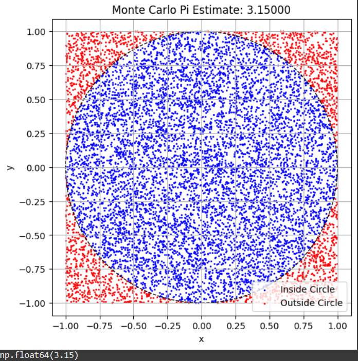
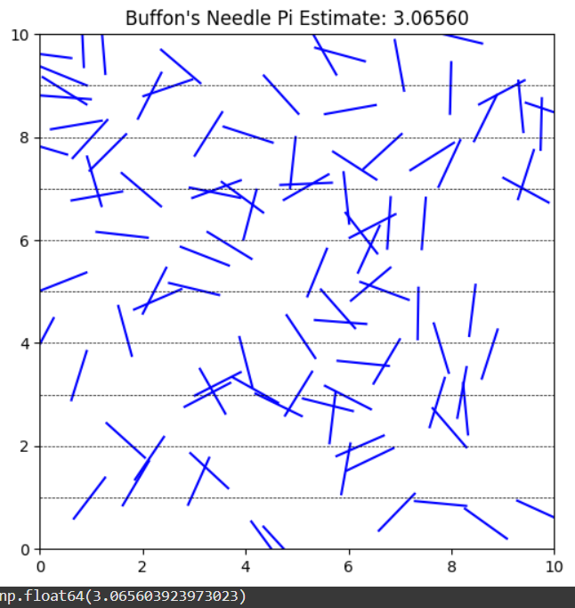

# Estimating $\pi$ Using Monte Carlo Methods

## Part 1: Circle-Based Monte Carlo Simulation

### 1. Theoretical Foundation

The idea is based on comparing the area of a unit circle (radius = 1) with the area of a square that bounds it.

- Area of the unit circle: $A_{\text{circle}} = \pi r^2 = \pi$
- Area of the square: $A_{\text{square}} = (2r)^2 = 4$

Random points are uniformly distributed in the square. The ratio of points that fall **inside the circle** to the total number of points approximates the ratio of the areas:

$$
\frac{\text{points inside circle}}{\text{total points}} \approx \frac{\pi}{4}
$$

Thus, we can estimate $\pi$ using:

$$
\pi \approx 4 \cdot \frac{\text{points inside circle}}{\text{total points}}
$$

### 2. Python Simulation (Circle Method)

```python
import numpy as np
import matplotlib.pyplot as plt

def estimate_pi_circle(n_points):
    x = np.random.uniform(-1, 1, n_points)
    y = np.random.uniform(-1, 1, n_points)
    inside_circle = x**2 + y**2 <= 1
    pi_estimate = 4 * np.sum(inside_circle) / n_points

    # Visualization
    plt.figure(figsize=(6,6))
    plt.scatter(x[inside_circle], y[inside_circle], s=1, color='blue', label='Inside Circle')
    plt.scatter(x[~inside_circle], y[~inside_circle], s=1, color='red', label='Outside Circle')
    circle = plt.Circle((0, 0), 1, fill=False, color='black', linestyle='--')
    plt.gca().add_artist(circle)
    plt.title(f"Monte Carlo Pi Estimate: {pi_estimate:.5f}")
    plt.xlabel("x")
    plt.ylabel("y")
    plt.axis('equal')
    plt.legend()
    plt.grid(True)
    plt.show()

    return pi_estimate

# Example usage
estimate_pi_circle(10000)
```

---

## Part 2: Buffon's Needle Simulation

### 1. Theoretical Foundation

Buffon's Needle problem involves dropping a needle of length $L$ onto a floor with parallel lines spaced distance $D$ apart. If $L \leq D$, the probability $P$ that the needle crosses a line is:

$$
P = \frac{2L}{\pi D}
$$

Rearranging gives an estimate for $\pi$:

$$
\pi \approx \frac{2L \cdot N}{D \cdot C}
$$

Where:
- $N$ = total needle drops
- $C$ = number of crossings

### 2. Python Simulation (Buffon's Needle)

```python
import numpy as np
import matplotlib.pyplot as plt

def estimate_pi_buffon(n_drops, needle_length=1.0, line_distance=2.0):
    assert needle_length <= line_distance, "Needle length must be <= line spacing"

    # Randomly generate needle centers and angles
    centers = np.random.uniform(0, line_distance / 2, n_drops)
    angles = np.random.uniform(0, np.pi / 2, n_drops)
    crosses = centers <= (needle_length / 2) * np.sin(angles)

    # Estimate pi
    n_crosses = np.sum(crosses)
    if n_crosses == 0:
        return None  # Avoid division by zero
    pi_estimate = (2 * needle_length * n_drops) / (line_distance * n_crosses)

    # Visualization
    plt.figure(figsize=(6,6))
    for i in range(100):
        x0 = np.random.uniform(0, 10)
        y0 = np.random.uniform(0, 10)
        theta = np.random.uniform(0, 2 * np.pi)
        x1 = x0 + (needle_length / 2) * np.cos(theta)
        x2 = x0 - (needle_length / 2) * np.cos(theta)
        y1 = y0 + (needle_length / 2) * np.sin(theta)
        y2 = y0 - (needle_length / 2) * np.sin(theta)
        plt.plot([x1, x2], [y1, y2], 'r-' if abs(y1 - y2) > line_distance else 'b-')
    for i in range(0, 11):
        plt.axhline(i, color='black', linestyle='--', linewidth=0.5)
    plt.title(f"Buffon's Needle Pi Estimate: {pi_estimate:.5f}")
    plt.xlim(0, 10)
    plt.ylim(0, 10)
    plt.gca().set_aspect('equal')
    plt.show()

    return pi_estimate

# Example usage
estimate_pi_buffon(10000)
```

---

## Part 3: Convergence and Analysis

As the number of iterations ($N$) increases, the estimates for $\pi$ from both methods converge toward the true value. Circle-based estimation usually converges faster and is simpler to implement.

### Summary Comparison Table

| Method           | Formula Used | Convergence Rate | Visualization Simplicity | Accuracy (for large $N$) |
|------------------|--------------|------------------|----------------------------|---------------------------|
| Circle Method    | $\pi \approx 4 \cdot \frac{\text{inside}}{\text{total}}$ | Fast | High | High |
| Buffon's Needle  | $\pi \approx \frac{2L \cdot N}{D \cdot C}$ | Slow | Moderate | Moderate |
