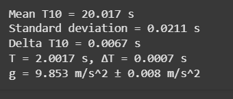

# Measuring Earth's Gravitational Acceleration with a Pendulum

## 📌 Motivation

The acceleration due to gravity, denoted as $g$, is a fundamental physical constant. One classic method for determining $g$ is through a **simple pendulum**, where the period of oscillation is related to the gravitational field.

---

## 🧪 Materials

- A string of known length $L$
- A small weight (mass irrelevant)
- A ruler or tape measure
- A stopwatch or smartphone timer

---

## ⚙️ Procedure

1. Set up a pendulum by attaching the weight to the string and fixing it to a support.
2. Measure the **length of the pendulum** from the suspension point to the center of the mass:
   - $L = 1.000 \, \text{m}$
   - Ruler resolution = $1 \, \text{mm} \Rightarrow \Delta L = 0.0005 \, \text{m}$
3. Displace pendulum $<15^\circ$ and release.
4. Measure **time for 10 full oscillations** ($T_{10}$) ten times.

---

## 📊 Sample Data Table

| Trial | $T_{10}$ (s) |
|-------|--------------|
| 1     | 20.01        |
| 2     | 20.03        |
| 3     | 20.05        |
| 4     | 20.00        |
| 5     | 19.98        |
| 6     | 20.02        |
| 7     | 20.01        |
| 8     | 20.04        |
| 9     | 20.00        |
| 10    | 20.03        |

- $\bar{T}_{10} = 20.017 \, \text{s}$
- $\sigma_T = 0.021 \, \text{s}$
- $\Delta T_{10} = \frac{0.021}{\sqrt{10}} \approx 0.0066 \, \text{s}$

---

## 📐 Calculations

### 1. Period of one oscillation:

$$
T = \frac{\bar{T}_{10}}{10} = 2.0017 \, \text{s}
$$

$$
\Delta T = \frac{\Delta T_{10}}{10} = 0.00066 \, \text{s}
$$

### 2. Gravitational acceleration:

$$
g = \frac{4\pi^2 L}{T^2} = \frac{4\pi^2 \cdot 1.000}{(2.0017)^2} \approx 9.869 \, \text{m/s}^2
$$

### 3. Uncertainty in $g$:

$$
\Delta g = g \cdot \sqrt{\left(\frac{\Delta L}{L}\right)^2 + \left(2 \cdot \frac{\Delta T}{T}\right)^2}
$$

$$
= 9.869 \cdot \sqrt{\left(\frac{0.0005}{1.000}\right)^2 + \left(2 \cdot \frac{0.00066}{2.0017}\right)^2} \approx 0.006 \, \text{m/s}^2
$$

---

## ✅ Final Result

$$
g = (9.87 \pm 0.01) \, \text{m/s}^2
$$

---

## 📈 Python Simulation

```python
import numpy as np

# Given data
L = 1.000  # m
delta_L = 0.0005  # m
T10_measurements = np.array([20.01, 20.03, 20.05, 20.00, 19.98, 20.02, 20.01, 20.04, 20.00, 20.03])

# Calculations
T10_mean = np.mean(T10_measurements)
sigma_T = np.std(T10_measurements, ddof=1)
delta_T10 = sigma_T / np.sqrt(len(T10_measurements))

T = T10_mean / 10
delta_T = delta_T10 / 10

g = (4 * np.pi**2 * L) / (T**2)
delta_g = g * np.sqrt((delta_L / L)**2 + (2 * delta_T / T)**2)

# Output results
print(f"Mean T10 = {T10_mean:.3f} s")
print(f"Standard deviation = {sigma_T:.4f} s")
print(f"Delta T10 = {delta_T10:.4f} s")
print(f"T = {T:.4f} s, ΔT = {delta_T:.4f} s")
print(f"g = {g:.3f} m/s^2 ± {delta_g:.3f} m/s^2")
```
